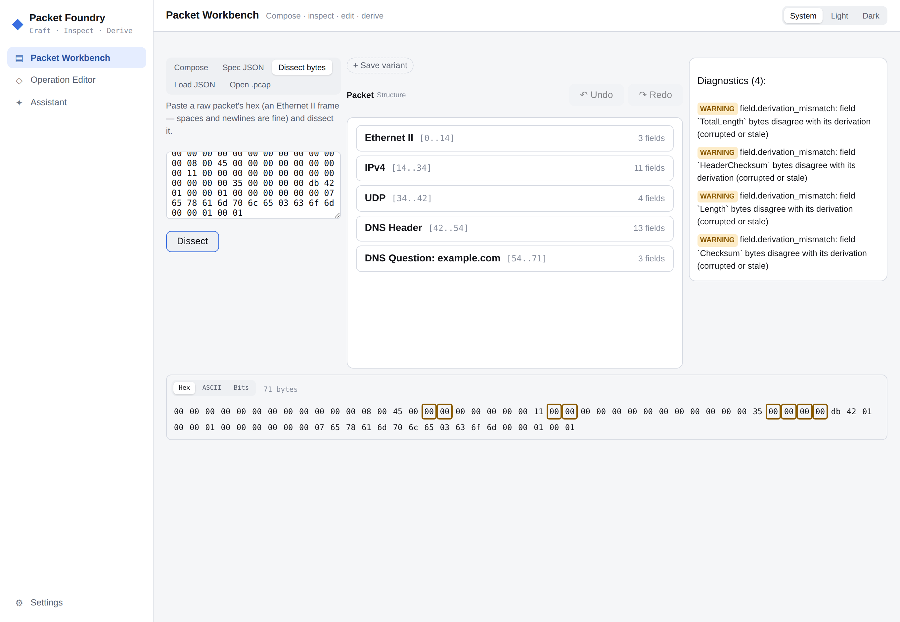
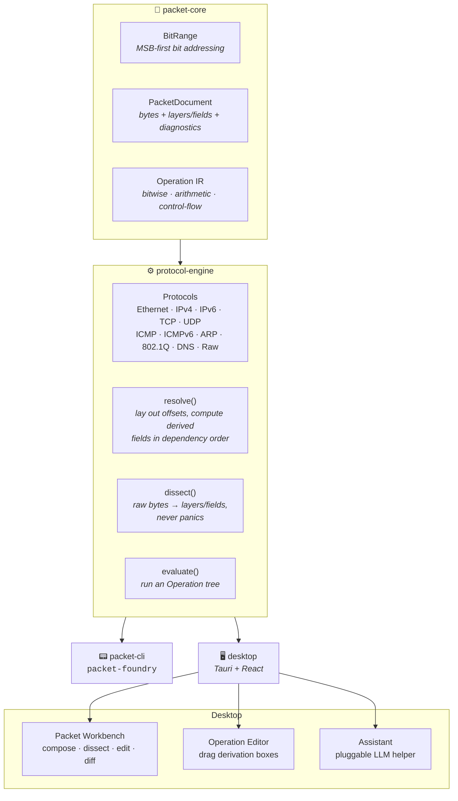
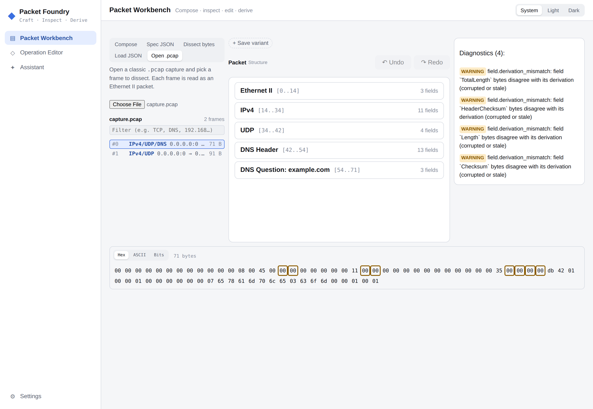
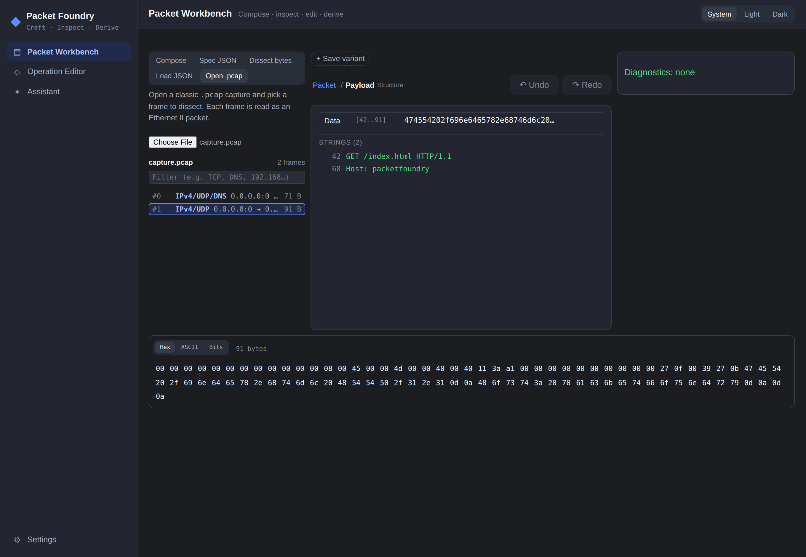

<div align="center">


# Packet Foundry

**A bidirectional, byte-authoritative workbench for wire formats — build a packet from meaning,
or dissect raw bytes back into it, and edit either at the bit level without ever losing a byte.**

[](https://www.rust-lang.org)
[](https://v2.tauri.app)
[](https://react.dev)
[](#license)
[](#development)

</div>

Where Ghidra/Cutter run the abstraction ladder *bytes → meaning* to understand a binary, Packet
Foundry runs it **both ways** for network packets. Go *meaning → bytes* to **build**: compose
protocol layers and fields (or a drag-and-drop puzzle of bitwise / arithmetic / control-flow
"boxes"), and the engine lays out offsets and resolves derived fields — checksums, lengths — into
bytes. Go *bytes → meaning* to **dissect**: paste raw hex or open a `.pcap`, and the same engine
walks it back into a navigable stack of layers and fields.

Because the byte buffer stays authoritative in both directions, **any** packet — including
malformed, truncated, or deliberately invalid ones — round-trips losslessly, with diagnostics that
*describe* problems (a checksum that doesn't match, a length that's off) rather than block them or
silently "fix" them.



## Install

One command sets up everything — Rust, Node, the Tauri system libraries, and both builds:

```sh
git clone https://github.com/MKlolbullen/Packet-Foundry.git
cd Packet-Foundry
./install.sh            # add --bundle for an installable desktop app
```

Safe to re-run; every step checks before it installs. `./install.sh --dry-run` shows what it
would do first (`--help` lists the options). It handles apt / dnf / pacman on Linux and Homebrew
on macOS; on Windows use WSL2. Then:

```sh
./target/release/packet-foundry --help    # the CLI
cd desktop && npm run tauri dev           # the desktop app, hot-reloading
```

### CLI quick start

```sh
packet-foundry create ethernet ipv4 tcp \
  --src-ip 192.168.1.10 --dst-ip 192.168.1.20 --dst-port 443 --flags syn \
  --output syn.packet.json

packet-foundry inspect syn.packet.json    # layers, fields, and diagnostics
```

`create` assembles an ordered protocol stack; `inspect` loads a document and re-validates it. The
desktop app is where the bit-level editing, dissection, `.pcap` import, and diffing live.

## How it fits together



| Crate | Role |
|-------|------|
| `packet-core` | Byte-buffer-authoritative document model: `BitRange`, `Operation` IR, layers/fields, diagnostics, JSON. |
| `protocol-engine` | Operation evaluator, dependency-ordered `resolve()`, a never-panic reverse `dissect()`, and built-in protocols (Ethernet II, IPv4, IPv6, TCP, UDP, ICMP, ICMPv6, ARP, 802.1Q VLAN, DNS, raw). |
| `packet-cli` | `packet-foundry` CLI — assemble packets to JSON and inspect them. |
| `desktop` | Tauri + React shell over the same engine crates: a **Packet Workbench**, an **Operation Editor**, and an **Assistant**. |

See [`docs/phase-1-design.md`](docs/phase-1-design.md) for the engine design.

## The Packet Workbench

The main workspace. Get a packet in one of five ways, then navigate and edit the result the same
way regardless of where it came from:

- **Compose** — build a stack visually from a protocol palette.
- **Spec JSON** — hand-write an ordered `ProtocolSpec` array and assemble it.
- **Dissect bytes** — paste raw hex (a Wireshark-style spaced dump is fine) and walk it into layers.
- **Load JSON** — reload a saved `PacketDocument` exactly as-is; bytes never change, only diagnostics.
- **Open .pcap** — open a capture file and browse its frames (below).

**Navigate like a map.** Double-click to *dive* (Packet → Layer → Field → Byte → Bit), `Escape` to
rise, `Alt+←`/`Alt+→` to walk your focus history, breadcrumbs to jump. A single click selects a
field and cross-highlights its exact bytes in the hex/ASCII/bit rail at the bottom; diagnostics
cross-highlight the same way.

**Edit at any level — Structured, Raw, or a single bit.** Diving into a field shows its range,
value, and state (plain / derived / pinned), plus an editor: *Structured* mode takes the field's
natural form (dotted-decimal for `ipv4_addr`, colon-hex for `mac_addr` / `ipv6_addr`, decimal for
`uint`, `0x`-hex for `flags`); *Raw* mode takes hex bytes; sub-byte fields (a `Version` nibble, a
flag) edit as values, and in the Byte/Bit inspectors you can flip an individual bit and it pins the
owning field. Committing a value **pins** the field — derivations recompute around it, and a pin
that disagrees with its own derivation raises a diagnostic rather than being silently corrected.
Every edit is undoable (`Ctrl+Z` / `Ctrl+Shift+Z`).

**Diff and variants.** Save the current packet as a named **variant**, and every variant is diffed
live against a base — a compact tally of what changed per branch, so you can craft a family of
related packets (a SYN, its SYN-ACK, a malformed twin) and see at a glance how each differs. A
Changes panel spells out the field-level diff and cross-highlights it in the hex rail.

**Payload strings.** Any opaque region (a `Payload`, a raw blob) surfaces a Ghidra-style list of
printable-ASCII runs with byte offsets; click one to highlight its bytes.

### Open a .pcap

Open a classic libpcap file and browse its frames — each row labelled with a shallow protocol peek
(`IPv4/TCP`, `VLAN/IPv6/UDP`, `ARP`, port 53 tagged `/DNS`) and its endpoints, with a filter box to
find frames by protocol, address, or index. Pick a frame and it dissects into the same workbench.



### Dissection

`dissect()` walks raw bytes into layers/fields for Ethernet II frames and everything the engine
knows — IPv4/IPv6, TCP/UDP/ICMP/ICMPv6, ARP, 802.1Q VLAN (including the recursive inner ethertype),
and DNS (header, questions, and resource records, with RFC 1035 name-compression pointers decoded
right into the layer title). It **never panics**: every read is length-gated, unknown or malformed
regions become opaque `Raw` layers plus diagnostics, and the captured bytes are never rewritten.

**Theme** — System / Light / Dark, persisted. The whole UI is built on a CSS design-token palette,
so dark mode is a first-class rich dark gray with clearly visible borders — not a dimmed
afterthought. Here, a captured HTTP payload's extracted strings in dark mode:



## The Operation Editor

The *computation* axis. A derived field's "View derivation →" opens its `Operation` tree; the
Operation Editor lets you build and evaluate those trees directly — drag bitwise / arithmetic /
control-flow boxes onto a pannable, zoomable canvas (drag empty space to pan, scroll to zoom, or use
the toolbar's zoom/fit controls). This is the real IPv4 header-checksum expression, evaluated
against the known-good test vector:


**Control-flow boxes** — `Loop`/`If` render as Scratch/Blockly-style "C-blocks": the condition sits
inline in the header, the body wrapped by a connecting rail. Reserved (the Phase 1 evaluator doesn't
execute them yet), but they round-trip and compose like any other box:


Diving from a field into its derivation shows the same tree rendered read-only — blue is the
*structure* axis, the violet accent marks the switch into *computation*:


## LLM helper

The gear icon opens **LLM Settings** — pick a provider, model, and API key. One "OpenAI-compatible"
adapter covers OpenAI, Groq, OpenRouter, Ollama, and anything else that speaks the
`/chat/completions` shape via a configurable base URL; Anthropic and Google Gemini get their own
adapters. Settings are stored as plain JSON in the app's local config directory — unencrypted, so
treat it like any other local API key file.


**Assistant** — a chat tab for asking about protocols, checksums, or how to structure an `Operation`
tree. It doesn't read your packet documents automatically; paste in whatever context you want:


**Generate with AI** — in the Operation Editor's palette, describe the box tree you want in plain
language and it replaces the canvas with the result. The reply is deserialized straight into the
engine's real `Operation` type, so a tree the engine can't run surfaces as an ordinary error rather
than silently not working:


## Development

The engine crates are pure Rust with no GUI dependency; the desktop app layers Tauri + React on top
of the exact same crates. The reverse dissector and the `.pcap` / strings / frame-peek helpers are
covered by unit tests on both sides.

```sh
cargo test --workspace              # 160 engine/CLI tests
cargo clippy --workspace --all-targets
cd desktop && npm test              # 168 frontend tests (Vitest)
cd desktop && npm run tauri dev     # hot-reloading desktop app
```

## License

MIT OR Apache-2.0.
