<div align="center">

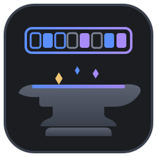

# Packet Foundry

**A bidirectional, non-lossy assembler for wire formats — craft, mutate, and torture-test
network packets at the bit level.**

[](https://www.rust-lang.org)
[](https://v2.tauri.app)
[](https://react.dev)
[](#license)
[](#development)

</div>

Where Ghidra/Cutter run the abstraction ladder *bytes → meaning* to understand a binary,
Packet Foundry runs it *meaning → bytes* to build one: you compose protocol layers and fields
(or a drag-and-drop puzzle of bitwise / arithmetic / control-flow "boxes"), and the engine lays
out offsets and resolves derived fields (checksums, lengths) into bytes. Because the byte buffer
stays authoritative, any packet — including malformed, truncated, or deliberately invalid ones —
round-trips losslessly, with diagnostics that *describe* problems rather than block them.

## Install

One command sets up everything — Rust, Node, the Tauri system libraries, and both builds:

```sh
git clone https://github.com/MKlolbullen/Packet-Foundry.git
cd Packet-Foundry
./install.sh            # add --bundle for an installable desktop app
```

Safe to re-run; every step checks before it installs. `./install.sh --dry-run` shows what it
would do first (`--help` lists the options). It handles apt / dnf / pacman on Linux and Homebrew
on macOS; on Windows use WSL2. Then:

```sh
./target/release/packet-foundry --help    # the CLI
cd desktop && npm run tauri dev           # the desktop app, hot-reloading
```

### CLI quick start

```sh
packet-foundry create ethernet ipv4 tcp \
  --src-ip 192.168.1.10 --dst-ip 192.168.1.20 --dst-port 443 \
  --output syn.packet.json

packet-foundry inspect syn.packet.json
```

## How it fits together

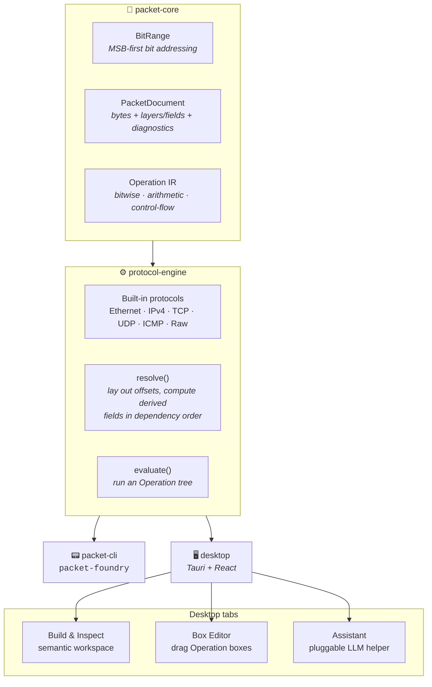

| Crate | Role |
|-------|------|
| `packet-core` | Byte-buffer-authoritative document model: `BitRange`, `Operation` IR, layers/fields, diagnostics, JSON. |
| `protocol-engine` | Operation evaluator, dependency-ordered resolve, built-in protocols (Ethernet II, IPv4, TCP, UDP, ICMP, raw). |
| `packet-cli` | `packet-foundry` CLI — assemble packets to JSON. |
| `desktop` | Tauri + React desktop shell — the same engine crates behind a GUI: a **semantic workspace** (navigate Packet → Layer → Field → Byte → Bit, edit any field or flip any bit with undo/redo, cross-highlight against a hex rail), a **Box Editor** (drag `Operation` boxes onto a canvas), and an **Assistant** backed by a pluggable LLM helper. |

See [`docs/phase-1-design.md`](docs/phase-1-design.md) for the engine design.

## The semantic workspace

**Build & Inspect.** Assemble a protocol stack from JSON, then navigate the result the way you'd
zoom a map: double-click to *dive* (Packet → Layer → Field → Byte → Bit), `Escape` to rise,
`Alt+←`/`Alt+→` to walk your focus history, breadcrumbs and the outline rail to jump anywhere. A
single click selects a field and cross-highlights its exact bytes in the hex rail at the bottom
(here: IPv4's derived `HeaderChecksum`, `b7 61`). Diagnostics live in their own rail and
cross-highlight the same way. Every pane split is a draggable divider — drag to resize,
double-click to reset, size persists across sessions:

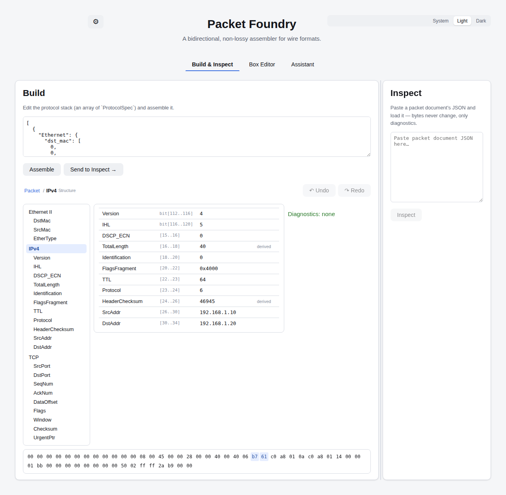

**Field editing — Structured or Raw, with undo/redo.** Diving into a field shows its range,
value, and state (plain / derived / pinned), plus an editor: *Structured* mode takes the field's
natural form (dotted-decimal for `ipv4_addr`, colon-hex for `mac_addr`, decimal for `uint`,
`0x`-hex for `flags`), *Raw* mode takes hex bytes. Sub-byte fields (a nibble `Version`, a flag)
edit as values; in the Byte/Bit inspectors you can flip an individual bit and it pins the owning
field. Committing a value pins the field (derivations recompute around it; a pinned value that
disagrees with its own derivation raises a diagnostic rather than being silently "fixed"). Every
edit is undoable — `Ctrl+Z`/`Ctrl+Shift+Z` or the Undo/Redo buttons by the breadcrumbs:

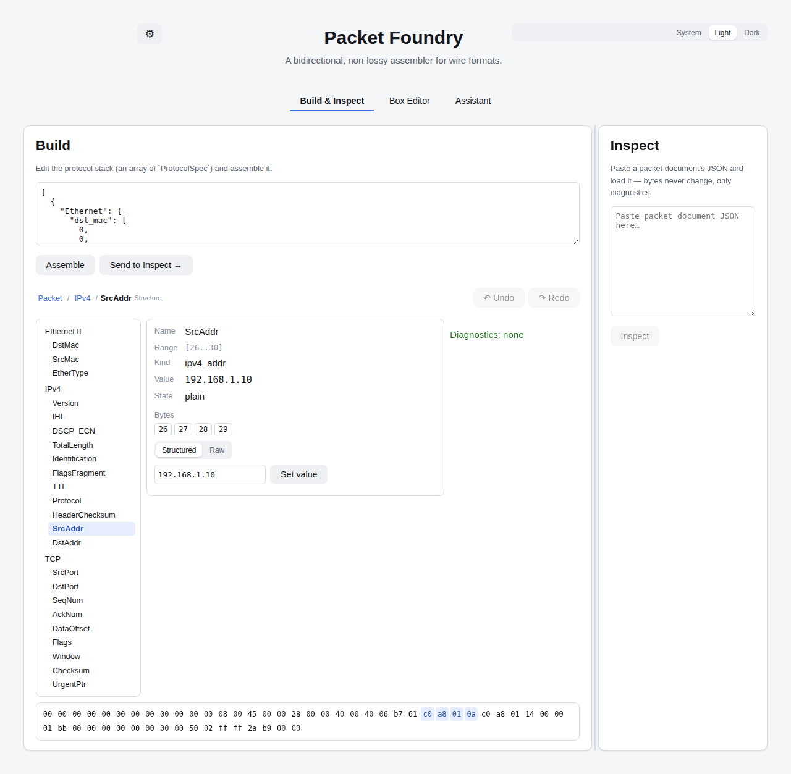

**The computation axis.** A derived field's "View derivation →" dives out of the packet's
*structure* and into its *computation*: the field's `Operation` tree rendered read-only with the
same box renderer the Box Editor uses. The violet accent marks the axis switch — blue is
structure, violet is computation:

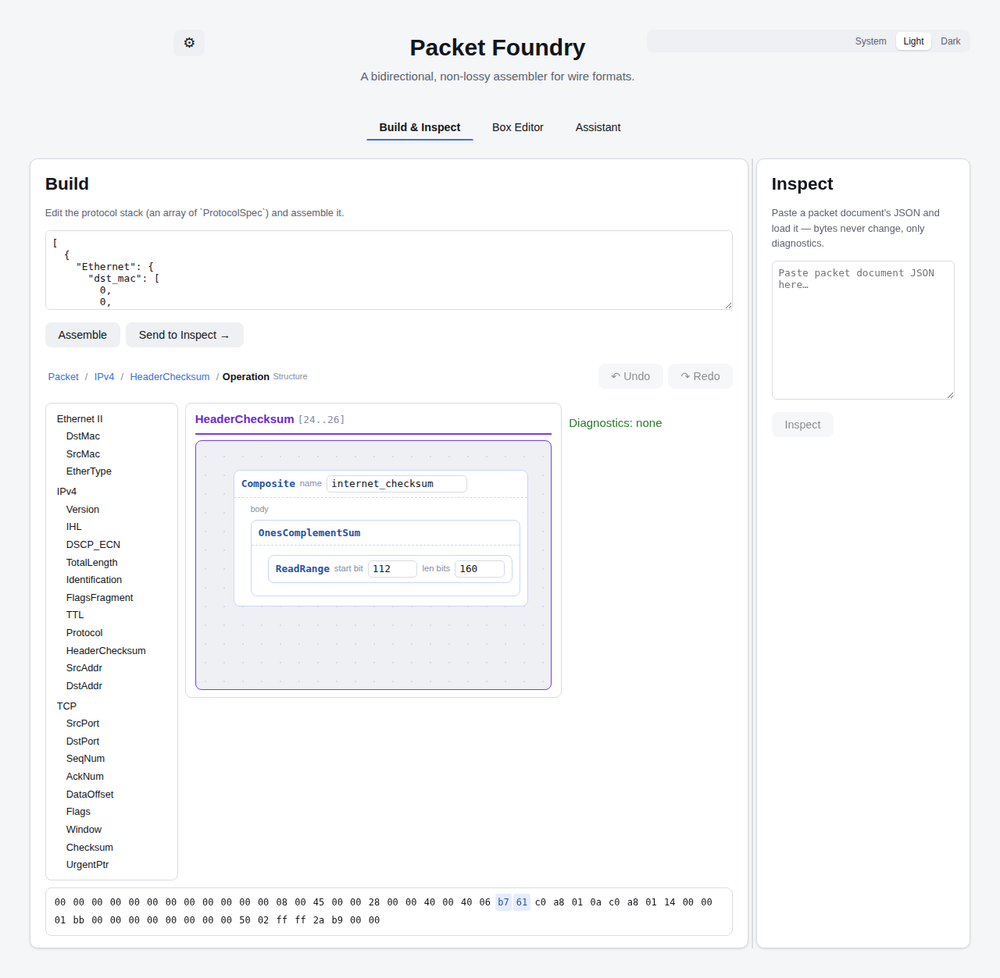

**Box Editor** — drag `Operation` boxes onto a pannable, zoomable canvas (drag empty space to
pan, scroll to zoom, or use the toolbar's zoom/fit controls); this is the real IPv4 header
checksum expression, evaluated against the known-good test vector:

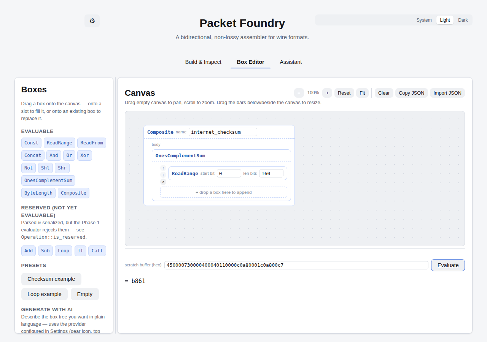

**Control-flow boxes** — `Loop`/`If` render as Scratch/Blockly-style "C-blocks": the condition
sits inline in the header, the body is wrapped by a connecting rail instead of just another
labeled slot. Reserved (the Phase 1 evaluator doesn't execute them yet), but round-trip and
compose like any other box:

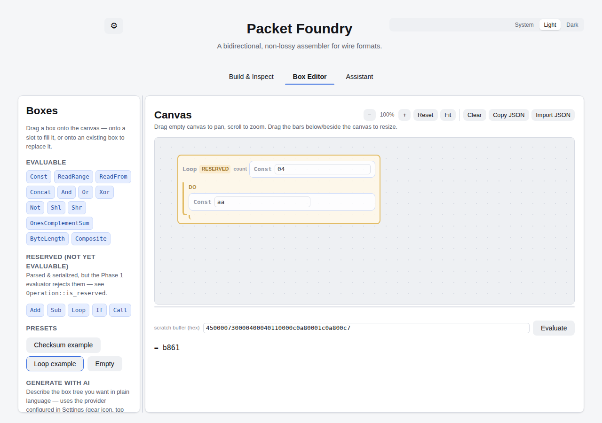

**Theme** — System/Light/Dark, top-right of the header, persisted across sessions. The whole UI
is built on a CSS design-token palette, so dark mode is a first-class rich dark gray with clearly
visible borders — not a dimmed afterthought:

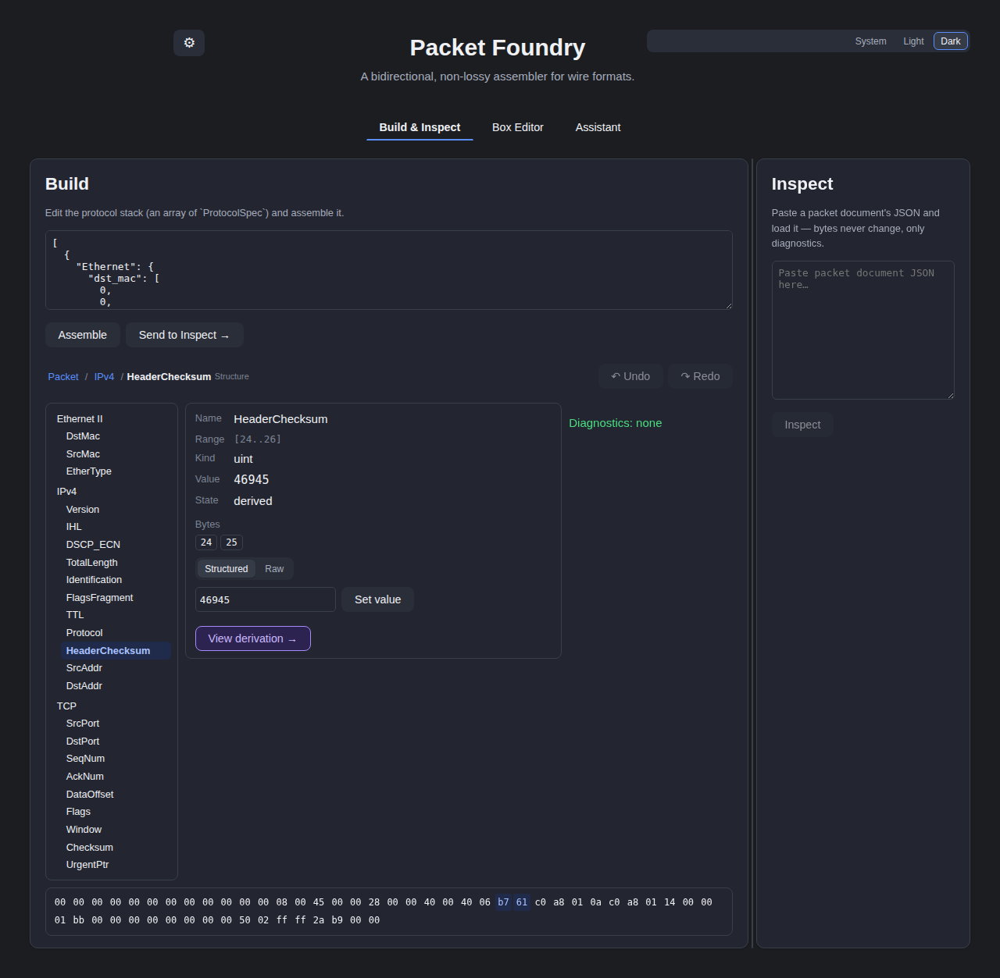

## LLM helper

The gear icon (top-left of the header) opens **LLM Settings** — pick a provider, model, and API
key. One "OpenAI-compatible" adapter covers OpenAI, Groq, OpenRouter, Ollama, and anything else
that speaks the `/chat/completions` shape via a configurable base URL; Anthropic and Google
Gemini get their own adapters for their native APIs. Settings are stored as plain JSON in the
app's local config directory — unencrypted, so treat it like any other local API key file.

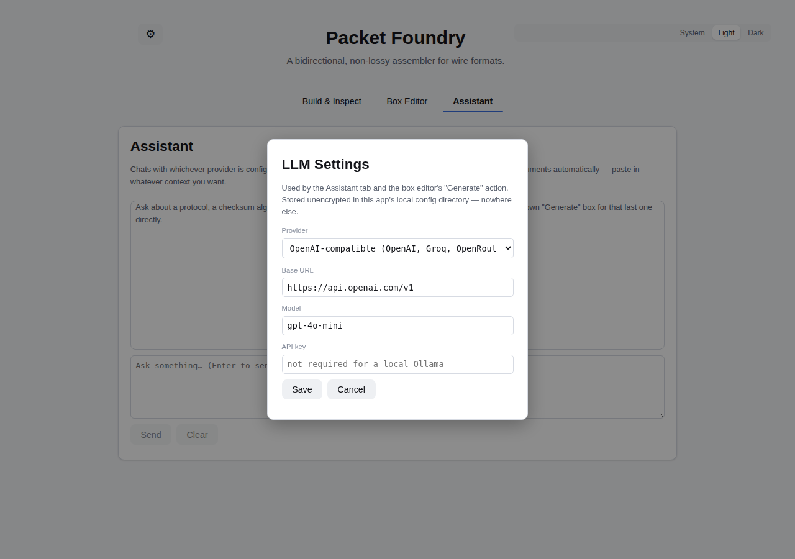

**Assistant** — a chat tab for asking about protocols, checksums, or how to structure an
`Operation` tree. It doesn't read your packet documents automatically; paste in whatever context
you want:

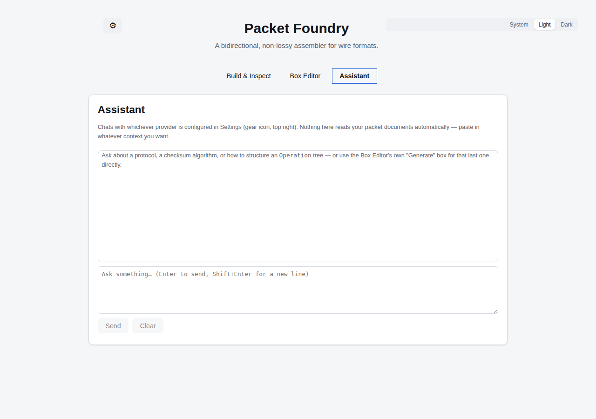

**Generate with AI** — in the Box Editor's palette, describe the box tree you want in plain
language and it replaces the canvas with the result. The model's reply is deserialized straight
into the engine's real `Operation` type, so a reply the engine can't actually run surfaces as an
ordinary error rather than a tree that silently doesn't work:

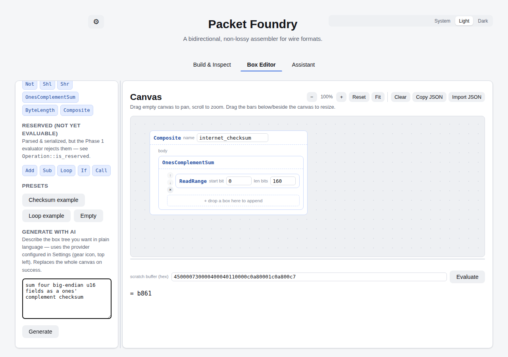

## Development

The engine crates are pure Rust with no GUI dependency; the desktop app layers Tauri + React on
top of the exact same crates.

```sh
cargo test --workspace              # 96 engine/CLI tests
cargo clippy --workspace --all-targets
cd desktop && npm test              # 102 frontend tests (Vitest)
cd desktop && npm run tauri dev     # hot-reloading desktop app
```

## License

MIT OR Apache-2.0.
